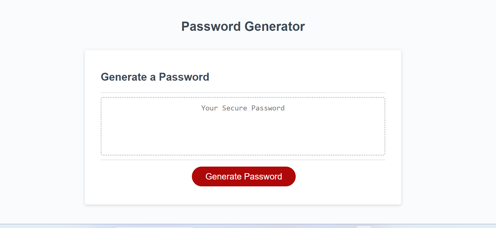

# 03-Password-Project

## Usage
This project creates a  password for a user to based on their input. The user will be able to customize their password via the prompts, and using JavaScript the password will be generated for them. While creating this project I furthered my understanding of how to structure variables, functions, and for loops in javascript to complete the task.  

## Description 
When clicking the Generate Password button, the user will be able to select the length of the password they would like. After that prompts will appear for the user to select a number, special character, and capital letter to be included in their password. Once all the prompts are read the user will see their password displayed in the center text box. 

Link to Deployed Page: 
